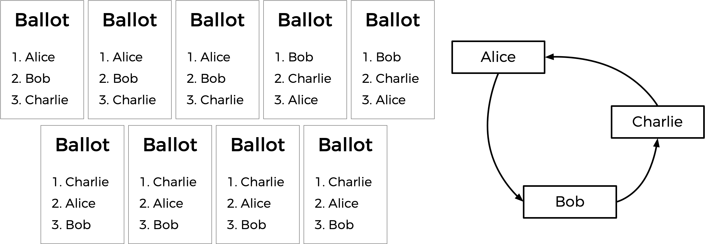

# Tideman method - Ranked-pairs electoral system
The implementation of a program (written in C) that runs a tideman election was a [problem set](https://cs50.harvard.edu/x/2020/psets/3/tideman/) from Harvard's course '[CS50: Introduction to Computer Science](https://cs50.harvard.edu/x/2020/)'. Back when I was taking the course, this was considered the hardest problem set among them all. A distribution code was provided, and we were supposed to construct key functions to complete the program. Being a novice in coding and computer science concepts, I honestly found it pretty challenging. After all, compared to modern languages, C might not the friendliest to beginners.

Years later, I went through a period without writing Python code, and decided to 'remake' this program from scratch to get my Python motors running up again. Also, I wanted to practice *type hinting*, gauge my current coding skills and see how well I would structure and organize the code.

A lot of this readme (including images) comes from the [problem set specification](https://cs50.harvard.edu/x/2020/psets/3/tideman/#background). 

## What is the Tideman method (or ranked-choice system)
In a ranked-choice system, voters can vote for more than one candidate. Instead of just voting for their top choice, **they can rank the candidates in order of preference**. The resulting ballots might therefore look like the below.

Here, each voter, in addition to specifying their first preference candidate, has also indicated their second and third choices. A possible tie between Alice and Bob (if we considered only the top choices) is broken by the last voter's second and third choices.

Ranked choice voting can also solve yet another potential drawback of *plurality* voting.

>Plurality voting: every voter gets one vote, and the candidate with the most votes wins. 

The Tideman voting method (also known as “ranked pairs”) is a ranked-choice voting method that’s guaranteed to produce the *Condorcet* winner of the election if one exists.

>Condorcet winner: the person who would have won any head-to-head matchup against another candidate.

Generally speaking, the Tideman method works by constructing a **directed graph** of candidates, where an edge from candidate A to candidate B indicates that candidate A wins against candidate B in a head-to-head matchup (most voters prefer A to B).
The Tideman method says the winner of the election should be the **source** of the graph (the candidate that has no edges pointing at them). 

It’s possible, however, that no Condorcet winner is produced. This is result of a graph with no source node.


* Alice is preferred over Bob by a 7-2 margin.
* Bob is preferred over Charlie by a 5-4 margin.
* Charlie is preferred over Alice by a 6-3 margin.

By simply connecting these nodes (candidates), the graph would end up without a source node. To work around such cases, the algorithm **locks in the strongest edges first**, since those are arguably the most significant. By *strongest* I mean the largest margin. In the example, that would be Alice vs. Bob.
If an edge can be added to the graph without creating a cycle or pointing to the last source node, proceed; otherwise, it is ignored.

In the above example, we have the following margins of victory (ordered by strength):

* Alice over Bob (7-2 margin)
* Charlie over Alice (6-3 margin)
* Bob over Charlie (5-4 margin)

But notice that if we add the last edge, there will be no source node left. So the process happens as follows:


Based on the resulting graph, Charlie is the winner of the ballot.

## Usage
```py
python3 tideman.py
```
