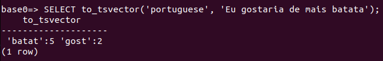

# Inverted Index
>TL;DR this project consists of an ETL process that get data from the Twitter API, and the creation of a inverted index of tweets text using PostgreSQL to achieve full text search with superior performance. 

>If you want to skip the background on indexes and inverse indexes, you can go straight to [Overview](https://github.com/lucascorumba/study-projects/tree/main/tweet-inverted-index#project-overview) to see a general outline of the project or to [Experimentation](https://github.com/lucascorumba/study-projects/tree/main/tweet-inverted-index#experimentation) to check out some queries and performance tests.

## Background

### Indexes
When retrieving values from tables, a *sequential scan* is **avoided whenever possible**. One way to improve queries performance is making **indexes**. This increase in performance comes with extra cost of memory and processing. 
We can think of indexes as *hints* to where rows are located within a table. Or even data about location of data.
>Actually, they are hints to which **block** contains the queried data, but delving into this is beyond the scope of this project. I think a "key-to-row hint" analogy should suffice.

There are different kinds of indexes in PostgreSQL, and we can divide them in **forward indexes**(the "normal" index) and **inverted indexes**. 
By default, a statement like the one below will create a **B-tree** index (one of the forward indexes), which is good for most cases.
```
CREATE INDEX name ON table (column);
```
We can specify what kind of index we want to build with the `USING` clause:
```
CREATE INDEX name ON table USING hash (column);
```
This one created a **hash** index, also one of the forward indexes.

Also, we are not limited to indexing columns (in fact, there are tons of quirks and options. To check all of them, see the [documentation](https://www.postgresql.org/docs/current/sql-createindex.html)), the key field(s) for the index can be specified as **expressions**. As long as we use the same expression in the *WHERE* clause, it will work just fine. 
We will do that in time. But before that, let's take a better look at **inverted indexes**.

### Inverted Indexes
It's all a matter of *what you have* and *what are you trying to find*.
In forward indexes, the general idea is that from a key (indexed) value, a row can be found. 
Inverted indexes go the other way around, we present a **query** and get back a list of *all* rows that match that query. 
A forward index would store:
```
{ doc_1: ["SQL is awesome"] }
```
While an inverted index would store:
```
{ "SQL": [doc_1], "is": [doc_1], "awesome": [doc_1] }
```
It works when you have a column with more than one thing, like a text (texts have multiple words). In a way, this column will have *multiple keys*. Other way to put it is that we get a mapping from the keyword to the document.

In this context, we are not interested in finding one specific row, but finding a set of rows instead.
For instance, we could query for texts that contain the word "SQL" and get back all the documents that match our query.
In fact, one of the main uses for inverted indexes is fast text search.

*To see all PostgreSQL indexes types, [check this link](https://www.postgresql.org/docs/current/indexes-types.html).*

Just like B-trees for forward indexes, the preferred text search-type index is the **Generalized Inverse Index** (GIN). It provides exact matches and efficiency on lookups, but can be costly for inserts and updates.
One workaround for this downside is to load all the data and build the GIN *later*. But if the insert/update overhead is too great and lookup is not a priority, a **Generalized Search Tree** (GiST) might be better suited.

>In this project, I built a GIN after extracting all the data I wanted.
I went this way because my project outline was to load about 10.000 tweets and stop there. In a task with constant load of tweets and eventual lookups, a GiST would be a better idea.

*More on that [here](https://www.postgresql.org/docs/11/textsearch-indexes.html).*

### Making Inverted Indexes with PostgreSQL
The statement to make a GIN (or GiST) index is really the same as the one used for forward indexes:
```
CREATE INDEX name ON table USING gin(column);
```
The difference lies in what we can use in the `column` field: a **`tsvector`**. 

But what is a tsvector? To answer that we should dig into **Text Search Functions**.

#### Text Search Functions
From the PostgreSQL [documentation](https://www.postgresql.org/docs/9.1/datatype-textsearch.html):
>"PostgreSQL provides two data types that are designed to support full text search, which is the activity of searching through a collection of natural-language documents to locate those that best match a query. The **`tsvector`** type **represents a document** in a form optimized for text search; the **`tsquery`** type similarly **represents a text query**."

Let's take a look at it to get a better picture:


`to_tsvector()` takes two arguments, the **language** in what the document is written and the **document** itself. 
This function reduces a document text to *tsvector*, or put in another way, returns a list of words that represent the document. Sort of *reduces a document to its essence*.
The numbers are the positions of the words in the document.

Notice that not all words are returned, and even the ones that were are now different. That's because the function handled **stop words** and **stemming**.
>Stop words are words considered insignificant (does not add much information to the text) and, therefore, **filtered out**.  

>Stemming is the process of reducing a word to its **word stem**. For example both *'teaching'* and *'teaches'* would stem down to *'teach'*.



**In the examples I wrote 'I like potatoes' and 'I would like more potatoes' in portuguese*

Remember from the documentation quote that we also have a `ts_query` type. It works similarly to `ts_vector`, but we use it in `WHERE` clauses.


With just one word, this is a simple `ts_query`. But we can build more complex ones, for example:
- *'gostaria & batata'*: 'gostaria' **and** 'batata'
- *'gostaria <-> batata'*: 'gostaria' **followed by** 'batata'
- *'! gostaria & batata'*: **not** 'gostaria' **and** 'batata'
- [...](https://www.postgresql.org/docs/9.1/datatype-textsearch.html#DATATYPE-TSQUERY)

### Making Queries
For the most typical `WHERE` clause we would use the `@@` operator ([there are many](https://www.postgresql.org/docs/9.1/functions-textsearch.html#FUNCTIONS-TEXTSEARCH)) to see if a `ts_query` matches a `ts_vector`.


Even though 'comer' ('eat') isn't contained in the searched `ts_vector`, 'comi' ('ate') is. So the operation returned `t` (**True**), as both words stem down to the same thing.

### Back to Indexes
Time to return to:
>"Also, we are not limited to indexing columns, the key field(s) for the index can be specified as **expressions**."

As the column type of a GIN index has to be of `tsvector` type, we can use the `to_tsvector` function as a expression when defining the index. That statement would look like:
```
CREATE INDEX name ON table USING gin(to_tsvector('language', column));
```
Anyway, that is as far as we go with indexes for now. Next, let's take a look at the whole project.

## Project Overview
This is all very nice and fancy, but we need a good chunk of data to put it to work.

To fetch text data I used the [Twitter API v2](https://developer.twitter.com/en/docs/twitter-api). More specifically, the [mentions endpoint](https://developer.twitter.com/en/docs/twitter-api/tweets/timelines/api-reference/get-users-id-mentions). It returns all tweets mentioning a specified user. It also incudes replies to tweets made by the user we are checking on.

Analyzing recent mentions can be a good way to gauge how people are interacting to some brand, person or company.

This endpoint allow requests of 5 to 100 tweets. And up to the most recent 800 can be fetched if pagination is implemented. In the `get_tweets.get_params` call, we can specify how many tweets we're going to receive from each request using the `max_result` parameter.

To **improve performance** I used this range of tweets per request to define how often database writes would happen. Instead of writing tweets one at a time, it's best to do it in **batches** to avoid too many **database round trips**. Setting `max_result = 50` will get us 50 tweets per request and write *roughly* 50 in a single round trip.

Due to the **cleaning process** of the tweets body, some end up being excluded, so it's not a guarantee that exactly 50 tweets will be written to the database every single batch. 

This happens because in order to not end up adding meaningless words to the index (wasting memory and processing power), I chose to remove mentions inside the tweet body (e.g., *@someone*), some of which would still go through the `to_tsvector` filtering. I also removed *emojis*, so some tweets text would end up empty after the processing. These one are just skipped.

>As I'm writing this I realized that `to_tsvector` would handle *emojis* removal just fine. However, giving that `utils.clean_text` is not a big overengineering (*and I liked the `.encode().decode()` trick*) I'll leave it like that.

Since we are bound to the 800 most recent tweets and a 180 request per 15-minute window, there is a counter to keep track of tweets received in the responses. When we get close to this limit, the database connection is closed and the extraction process is interrupted to prevent going over the request rate limit. 

### About the Scripts
- `get_tweets.py`
    - Running this as the main script will make a request for 5 tweets. The response will be formatted and printed, but no changes are made, so we get to see all the data and metadata.
    - This script has all the logic necessary to make a connection to the endpoint, build the request and pagination.
- `hidden_dist.py` -> This one should be renamed to `hidden.py`
    - It holds the credentials to make a connection to the database. Add yours and rename the file.
- `utils.py`
    - Helper functions.
- `tweets_to_db.py`
    - Makes connection to the database.
    - Executes SQL commands and commits changes to the database.
    - Calls helper functions to clean data.
    - Control number of requests and writes.
- `commands.sql`
    - SQL statements used to create the index and test search performance.

## Experimentation
I'm really not into Twitter, so I didn't know about the trendy profiles. When I built this project the brazilian elections had happened a little while before, so I figured a lot of people would be talking about it. So a picked up the [@TSEjusbr](https://twitter.com/TSEjusbr) profile to make my tests.

I won't be showing the actual content of the tweets (count of matches or tweet id at most), as I'm only interested in running benchmarks and I know this might be a sensitive topic. 

With that being said, let's begin.

The **schema** of the table:


I collected about 10.000 tweets from November 22 to November 29. It ain't much, but it's ~~honest work~~ enough to get PostgreSQL attention and actually use the index.


How many times 'eleição' ('election') and 'voto' ('vote') show up:


And here we can see the improvement in performance. First, a forced sequential scan using *pattern matching*, and then, a query using the *index*.


We can even [rank](https://www.postgresql.org/docs/current/textsearch-controls.html#TEXTSEARCH-RANKING) the results. The better the 'match', the greater is the score.


And to wrap up things, I'm gonna bring in the potato jest one last time:


If I had a nickel for every potato mention in a election deliberation, I would have two nickels. Which isn't a lot, but it's weird that it happened twice.

## Requirements
It's recommended to not install required packages globally, but locally under a project subfolder using `venv`: 
```
python3 -m venv venv-name

# Windows
venv-name\Scripts\activate.bat    # cmd
venv-name\Scripts\activate.ps1    # Power Shell

# Unix
source venv-name/bin/activate
```
```
pip install psycopg2-binary
```
```
pip install requests
pip install requests-oauthlib
```

## Usage
```
export BEARER_TOKEN=<your_bearer_token>
```
```
python3 tweets_to_db.py
```